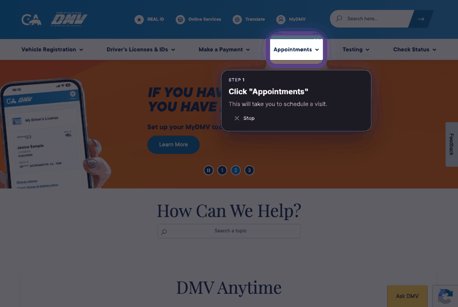
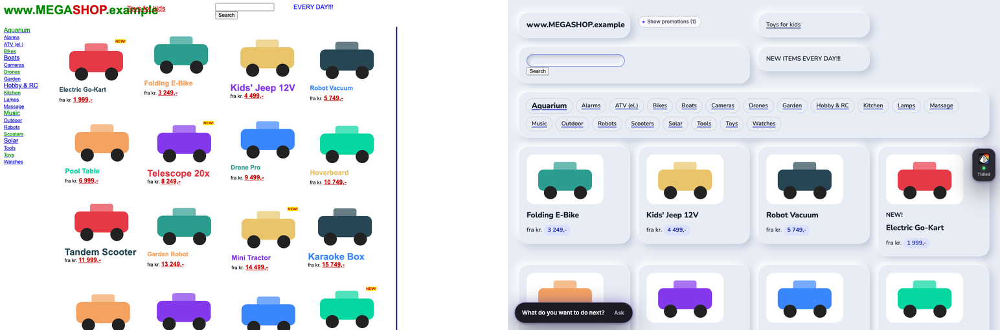
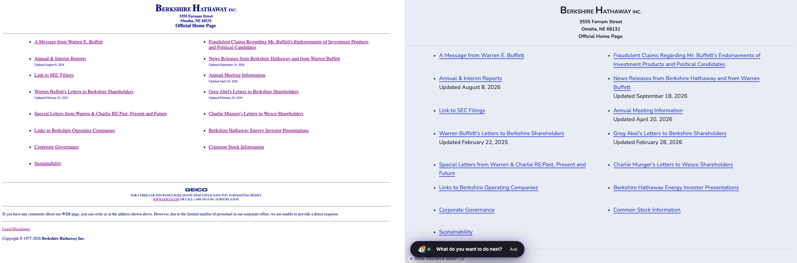
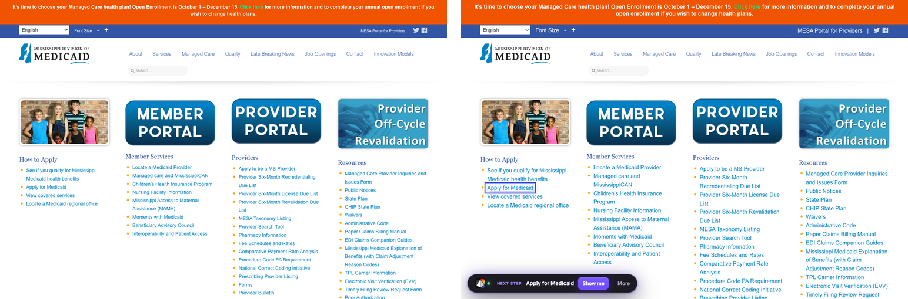

# Prism

**Website: [prism-helper.vercel.app](https://prism-helper.vercel.app)** · [How it's built](https://prism-helper.vercel.app/how-its-built.html)

**Websites, made calm and clear.** Prism is a free Chrome extension for anyone who finds the web confusing,
from a grandmother ordering a scarf to a 20-year-old booking their first DMV appointment. It makes cluttered
pages easier to read, explains anything you point at in plain words, and can walk you through a task one
step at a time. You stay in control: Prism points, you click.



*Guide me on the real California DMV website: "book an appointment to renew my driver's license", from the
home page to picking a time. Prism dims everything except the one thing to press, and says what it is.*

**[Download Prism](https://prism-helper.vercel.app)** · installs in less than a minute · no account needed

---

## What it does

### Guide me
Tell Prism what you want to do, typed or spoken ("send an email to my son", "renew my driver's licence").
Prism dims the page, shines a spotlight on the one button or box you need, and tells you what to do with it.
You do the clicking and typing yourself, so you learn the website as you go.

- **Works from anywhere**, even a blank new tab: Prism opens the right website for you.
- **Follows you** across pages and into new tabs, and answers in your language.
- **Never presses for you.** Before anything final (send, pay, place order, confirm, agree) it adds
  *"Check everything is right before you press it."*
- **Back** and **Stop** are always there.

### Tidy this page
One switch makes the page easier to read without breaking how it works.

- **Well-made sites keep their look.** Prism makes small text bigger, darkens faint grey text, hides adverts
  and gently highlights the page's main next step.
- **Old or chaotic pages get a full makeover** in your chosen style: calm cards, a clear reading order,
  readable text everywhere.
- **Four styles:** Neumorphism, Clean Flat, Modern Minimalist and Neo-Brutalist.
- **Nothing is lost.** Switch it off, or refresh, and the website is exactly as it was.

Before on the left, with Prism on the right:



*A chaotic shop page (a local test page modelled on real ones) gets the full makeover.*



*Berkshire Hathaway: tiny print becomes readable, with room to breathe.*



*Mississippi Medicaid keeps its design. Prism enlarges the small text and points at "Apply for Medicaid".*

### Point at anything
Hold **Option ⌥** (Mac) or **Alt** (Windows) and drag a box around anything confusing, including words
inside pictures. Choose:

- **Define:** what it means, in plain words.
- **Translate:** into your language.
- **Fill out:** what each question is asking, with suggested answers from what you've told Prism. You
  choose which answers go in, and Prism never sends the form.
- **Chat:** ask anything about the page.

### Read aloud
Press **Read aloud** on any answer, or **Read this page to me**, and Prism reads it in your language
using your computer's own voices.

### Your language
Prism speaks 12 languages: English, Español, Français, Português, 中文, हिन्दी, বাংলা, العربية, Tiếng Việt,
Tagalog, 한국어 and Русский. You choose on the first screen and can change it any time. Explanations and
translations work in many more.

### Talk instead of typing
Press **Talk** next to any box, on websites or in Prism, and say what you want to write.

---

## Install (less than a minute)

Prism isn't in the Chrome Web Store yet, so you add it the way developers do. It's safe and easy to remove.

1. **Download** `Prism.zip` from **https://prism-helper.vercel.app** and **unzip** it.
2. In Google Chrome, go to **`chrome://extensions`**.
3. Turn on **Developer mode** (top right).
4. Click **Load unpacked** and choose the `prism-extension` folder.
5. Pick your language. Then click the jigsaw-piece icon in the toolbar and **pin Prism**.

Also works in Microsoft Edge and Brave (`edge://extensions`, `brave://extensions`).

## How to use it

| To… | Do this |
|---|---|
| Get walked through a task | Click the Prism button, type or say what you want to do, press **Guide me** |
| Tidy a page | Prism button → **Tidy this page**. Tick *Tidy … automatically every time* to keep it on for that site |
| Give a site the full makeover | The Prism button at the bottom of the page → **Full makeover** |
| Explain something | Hold **Option ⌥ / Alt** and drag a box around it. Or Prism button → **Point at something**. Keyboard: **Alt+Shift+P** |
| Hear a page | The Prism button at the bottom of the page → **Read this page to me** |
| Go back to the original | Switch off **Tidy this page**, or refresh the page |
| Change style, text size or language | Prism's **Settings** |

## Try it on real websites

Important websites that are hard to use. These also appear as the practice websites on Prism's welcome page.

| Website | What it's for |
|---|---|
| [Illinois Human Services](https://www.dhs.state.il.us/page.aspx?item=29719) | Cash, food and medical help |
| [Mississippi Medicaid](https://medicaid.ms.gov/) | Apply for Medicaid |
| [craigslist](https://www.craigslist.org/) | Local classifieds, jobs and housing |
| [Berkshire Hathaway](https://www.berkshirehathaway.com/) | Company reports and letters |
| [Cook County Circuit Court Clerk](https://www.cookcountyclerkofcourt.org/) | Court services and records |
| [California EDD](https://edd.ca.gov/en/unemployment/) | Unemployment benefits |
| [Indian Health Service](https://www.ihs.gov/) | Federal health program |
| [TRICARE](https://www.tricare.mil/) | Military health insurance |
| [Indiana Family & Social Services](https://www.in.gov/fssa/) | Medicaid, SNAP and family help |
| [Social Security rules (POMS)](https://secure.ssa.gov/poms.nsf/home!readform) | How benefit claims are decided |
| [OPM Retirement Center](https://www.opm.gov/retirement-center/) | Federal retirement |
| [Social Security Actuarial Services](https://www.ssa.gov/oact/) | Benefit calculators and data |

## Privacy

- Your settings and anything you tell Prism about yourself stay in your browser. Chats are forgotten when
  you close the tab. Prism never saves what you type into websites.
- When you ask for help, only what that request needs is sent to Google's **Gemini** AI on **Vertex AI**
  through Prism's small service: a page outline (no form values), the area you pointed at, and the
  relevant parts of what you told Prism.
- Prism never reads, types or sends passwords or card details, and never sends a form or buys anything.
- Settings → **Your data** lets you see, download or delete everything.
- Prism is an independent project, not affiliated with Google, OpenAI or Anthropic.
- Full policy: [prism-helper.vercel.app/privacy.html](https://prism-helper.vercel.app/privacy.html)

## How it works

```
Browser extension (Chrome MV3, TypeScript + Preact)              Prism service (Python, FastAPI, Cloud Run)
  content script: read the page → tag elements → one stylesheet    ─────►  Gemini on Vertex AI
  spotlight, selection box, cards, chat (closed Shadow DOM)
  service worker: AI calls, Guide me loop, read aloud
  popup · settings · welcome · 12 languages
```

- **Tidying never replaces the page** or runs AI-written code. Prism decides how much to change (a light
  touch for well-designed sites, a full makeover for old ones), the AI labels the page's existing parts,
  and Prism's own CSS does the styling. Links, forms and logins keep working, and removing Prism's
  attributes restores the page exactly.
- **Guide me** reads the page, asks the AI for the single next step (only elements that really exist are
  accepted), and draws a spotlight with a hole the person clicks through. When the page changes, it
  plans again from the new page.
- **Website text is untrusted.** It can't instruct Prism, and Prism's actions are a fixed, checked set.

Design notes are in [`specs/`](specs/), and progress and test evidence in [PROGRESS.md](PROGRESS.md).

## For developers

**New to the code?** Start with [How Prism works](docs/HOW-PRISM-WORKS.md), a beginner-friendly tour with diagrams.

Requirements: Node 20+, Python 3.11+, Google Cloud CLI.

```bash
npm install
npm run build          # → extension/dist (load unpacked)
npm run package        # → release/prism-extension-v<version>.zip
```

**Run the AI service on your own computer** (uses your Google sign-in, no keys in files):

```bash
gcloud auth application-default login
python3 -m venv helper/.venv && helper/.venv/bin/pip install -r helper/requirements-dev.txt
scripts/start-helper.sh            # http://127.0.0.1:8787
```

The online service is deployed to Cloud Run with `scripts/deploy-helper.sh`, using a service account that
can only call Vertex AI, plus per-install and per-IP rate limits and a daily cap. Configuration example:
[`.env.example`](.env.example) (no secrets).

**Tests**

```bash
npm run typecheck && npm run test:unit
helper/.venv/bin/python -m pytest -q helper/tests
npx playwright test                # the real extension in Chrome for Testing, real Gemini answers
node scripts/secret-scan.mjs
node tools/guide-run.mjs tasks.json out/   # Guide me on real websites, acting like a person
```

The end-to-end tests run on local test pages (`fixtures/`) with real AI answers, not mocked ones.
`tools/review-scan.mjs` takes before and after screenshots of real sites for design review.

## Known limitations

- Pages the browser protects (Chrome settings, the new tab page, the Chrome Web Store) can't be changed.
  Guide me starts from the Prism button instead.
- Payment boxes embedded from other websites, and map or drawing apps, can be explained but not restyled.
- Guide me never signs in for you: when a site asks for a password, it points at the box and you type it.
- Firefox and Safari aren't supported yet.

## License

[MIT](LICENSE) © 2026 Prameet Guha and Kundan Baliga
