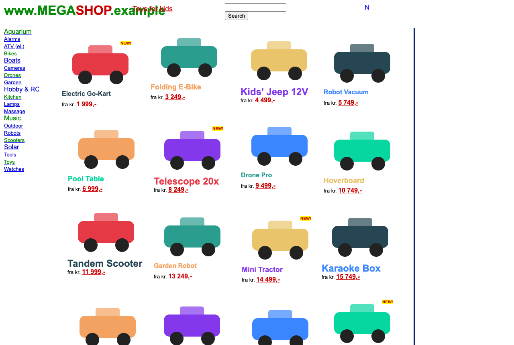
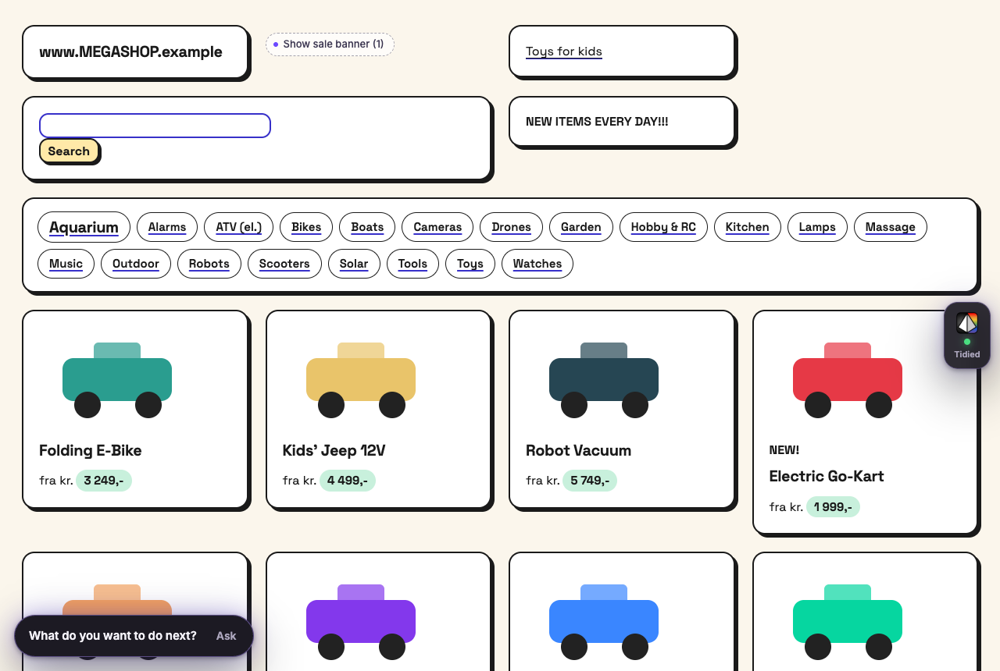

# Prism

**Websites, made calm and clear.** Prism is a browser extension that tidies confusing websites so they're
easier to read, explains anything you point at in plain words, helps you fill in forms, and can carry
out a task step by step — always asking before anything important happens.

It's designed first for people who find the web stressful — for example an older adult who is new to
technology — and to be pleasant for everyone.

| Before | After (Neo-Brutalist) |
| --- | --- |
|  |  |

| Feature | What it does |
| --- | --- |
| **Tidy this page** | Restyles the live page: readable text, clear hierarchy, obvious buttons, clutter tucked away. The website keeps working, and **Show original page** puts it back exactly. Layouts are remembered so the page looks the same next time. |
| **Four styles** | **Clean Flat**, **Modern Minimalist**, **Neo-Brutalist** and **Neumorphism** — complete design systems, not colour filters. |
| **Restructures chaotic pages** | On pages built as a pinned "canvas" (like arngren.net) or with layout tables, Prism reflows the pieces into a padded, rounded card grid in reading order, groups each product's picture, name and price, and turns long link lists into pills. |
| **Always readable** | After tidying, Prism measures every piece of text against what's really behind it and fixes anything below WCAG AA (white on white, grey on grey, colour on the same colour). Boxes that blend in get an outline. Adverts are hidden, not faded. |
| **Clear next step** | The page's main action becomes the biggest, gently glowing button, and a *Next step* bar shows what to do next with **Show me**. |
| **Point at something** | Hold **Option ⌥** (Mac) or **Alt** (Windows) and drag a box around anything. Choose **Define**, **Translate**, **Fill out** or **Chat**. Works on text *and* words inside pictures. |
| **Fill out** | Explains each question and suggests answers from what you've told Prism, showing where each answer came from. Puts answers in only when you say so, never sends the form, and can undo. |
| **Chat** | Ask about the page, or ask Prism to do a task ("report my missed bin"). It works step by step, and stops to ask before sending, submitting, paying, agreeing or deleting. **Stop** is always there. |
| **About you** | Optional details (name, language, reading needs, address for forms, people you help). Import from ChatGPT or Claude by pasting or with an export file. Stays in your browser. |

---

## Install (about 2 minutes, no account needed)

Prism isn't in the Chrome Web Store yet, so you add it the way developers do. It's safe and easy to
remove later.

1. **Download** `prism-extension-v0.1.0.zip` (from the project's releases, or build it — see below) and
   **unzip** it. You'll get a folder called `prism`.
2. In Google Chrome, go to **`chrome://extensions`** (type it in the address bar and press Enter).
3. Turn on **Developer mode** (switch at the top right).
4. Click **Load unpacked** and choose the `prism` folder.
5. A welcome page opens. Click the jigsaw-piece icon in the toolbar and **pin Prism** so its button is
   always visible.

That's it — Prism uses its online service automatically. Try it on the practice page linked from the
welcome page.

Also works in Microsoft Edge and Brave (`edge://extensions` / `brave://extensions`), though those
browsers weren't part of automated testing.

## How to use Prism

- **Tidy a page:** click the Prism button → turn on **Tidy this page**. Tick **Tidy … automatically every
  time** to keep it on for that website.
- **Choose a style:** in the Prism button's **Style** section, or Settings → Style for your default.
- **Point at something:** hold **Option ⌥/Alt** and drag a box. Or click the Prism button → **Point at
  something** and drag without holding keys. Or right-click → **Ask Prism about this**. Keyboard only:
  **Alt+Shift+P**, then arrow keys and Enter. **Esc** always cancels.
- **Talk instead of typing:** turn it on once (welcome page or Settings), then press **Talk** next to any
  box — on websites, in Chat, in the Next step box — and say what you want to write.
- **Find something on a page:** in Chat, say e.g. "emphasize the link about pro guitarists" — Prism makes
  it big, bold and highlighted. Or open **Next step → More** and type or say what you want to do next.
- **Get help with a form:** point at the questions → **Fill out** → tick the answers you want →
  **Put answers in**. Check them, then send the form yourself.
- **Tell Prism about you:** Settings → **About you** (all optional). To bring in what ChatGPT or Claude
  know about you: Settings → **Import from ChatGPT or Claude**.
- **Helping someone else:** in Chat, press **I'm helping someone else** or just say "I'm helping my mum
  Joan". Prism uses their details for that chat only and won't change your saved profile.
- **Go back to the original:** Prism button → turn off **Tidy this page**, or the **Show original page**
  button on Prism's side tab. **Tidy again from scratch** makes a fresh layout.

## Try it on real websites

Important websites that are hard to use, and look clearly better with Prism (screened from 85+ candidates,
October 2026). The same list is the purple Practice websites panel on Prism's welcome page.

| Website | What it's for | Kind |
|---|---|---|
| [Illinois Human Services](https://www.dhs.state.il.us/page.aspx?item=29719) | Cash, food and medical help | Benefits |
| [Mississippi Medicaid](https://medicaid.ms.gov/) | Apply for Medicaid | Healthcare |
| [craigslist](https://www.craigslist.org/) | Local classifieds, jobs and housing | Classifieds |
| [Berkshire Hathaway](https://www.berkshirehathaway.com/) | Company reports and letters | Investing |
| [Cook County Circuit Court Clerk](https://www.cookcountyclerkofcourt.org/) | Court services and records | Courts |
| [California EDD](https://edd.ca.gov/en/unemployment/) | Unemployment benefits | Benefits |
| [Indian Health Service](https://www.ihs.gov/) | Federal health program | Healthcare |
| [TRICARE](https://www.tricare.mil/) | Military health insurance | Insurance |
| [Indiana Family & Social Services](https://www.in.gov/fssa/) | Medicaid, SNAP and family help | Benefits |
| [Social Security rules (POMS)](https://secure.ssa.gov/poms.nsf/home!readform) | How benefit claims are decided | Social Security |
| [OPM Retirement Center](https://www.opm.gov/retirement-center/) | Federal retirement | Retirement |
| [Social Security Actuarial Services](https://www.ssa.gov/oact/) | Benefit calculators and data | Social Security |

## Privacy

- Settings, About you, people you help and saved layouts stay in your browser (`chrome.storage.local`).
  Chats are forgotten when you close the tab. Prism never saves what you type into websites, and never
  saves pictures of pages.
- When you ask for help, only what that request needs is sent to Google's **Gemini** model on
  **Vertex AI** via Prism's small service: a page outline for tidying (no form values), the selected area
  (and a picture of it when needed), and the relevant parts of About you.
- Prism never reads passwords or card details into AI requests, never types them, and never sends a form
  or makes a purchase without asking.
- Settings → **Privacy & your data** lets you see, download or delete everything.
- Prism is an independent project, not affiliated with Google, OpenAI or Anthropic.

## How it works

```
Browser extension (Chrome MV3, TypeScript + Preact)          Prism service (Python, FastAPI)
  content script: analyse page → tag elements → 1 stylesheet   ─────►  Gemini on Vertex AI
  selection overlay, cards, chat (closed Shadow DOM)                   (gemini-3.7-flash for page plans,
  service worker: AI calls, capture/crop, chat action loop             gemini-3.8-flash for help/chat,
  popup · settings · welcome                                            gemini-3.5-flash-lite fallback)
```

- **Tidy** never replaces the page or runs AI-written code. Gemini returns a validated *plan* (labels for
  existing elements); Prism's own CSS does the styling, so links, forms, validation and app state keep
  working, and removing Prism's attributes restores the page exactly.
- **Caching:** plans are saved per page (keyed by page address, page structure and preferences) so an
  unchanged page reloads into the same layout with no AI call. Stale plans fail safely.
- **Actions** use a fixed set (click, type, choose, tick, scroll, open) executed by Prism's code with
  risk checks. Website text is treated as untrusted data and can't instruct Prism.

Full specifications are in [`specs/`](specs/); progress and acceptance evidence in [PROGRESS.md](PROGRESS.md).

## For developers

Requirements: Node 20+, Python 3.11+, Google Cloud CLI.

```bash
npm install
npm run build          # → extension/dist (load unpacked)
npm run package        # → release/prism-extension-v<version>.zip
```

**Run the AI service on your own computer** (uses your Google sign-in; no keys in files):

```bash
gcloud auth application-default login
python3 -m venv helper/.venv && helper/.venv/bin/pip install -r helper/requirements-dev.txt
scripts/start-helper.sh            # http://127.0.0.1:8787
```

Then Settings → Prism service → **A helper on this computer**. Configuration example: [`.env.example`](.env.example)
(no secrets). The online service is deployed with `scripts/deploy-helper.sh` to Cloud Run using a
dedicated service account (Vertex AI user only), per-install/IP rate limits and a daily cap.

**Tests**

```bash
npm run typecheck && npm run test:unit
helper/.venv/bin/python -m pytest -q helper/tests
npx playwright test                # loads the real extension in Chrome for Testing; needs the local helper
node scripts/secret-scan.mjs
python3 scripts/contrast_check.py
```

End-to-end tests use local fictional fixtures (`fixtures/`, served by `npm run fixtures`) and real Gemini
responses — no mocked AI. Screenshots land in `evidence/e2e/`.

## Known limitations

- Browser-protected pages (Chrome settings, new tab page, Chrome Web Store, built-in PDF viewer) can't be
  changed; Prism explains this.
- Embedded forms from other websites (e.g. payment boxes) and map/drawing apps can be explained but not
  restyled or filled.
- Some websites ignore script-entered values; Prism reports which fields need typing by hand.
- Prism's own interface is in English; explanations and translations work in many languages.
- Firefox and Safari aren't supported yet. Install is via Developer mode until a store listing exists.
- See [specs/08-access-and-feasibility.md](specs/08-access-and-feasibility.md) for the full list.
