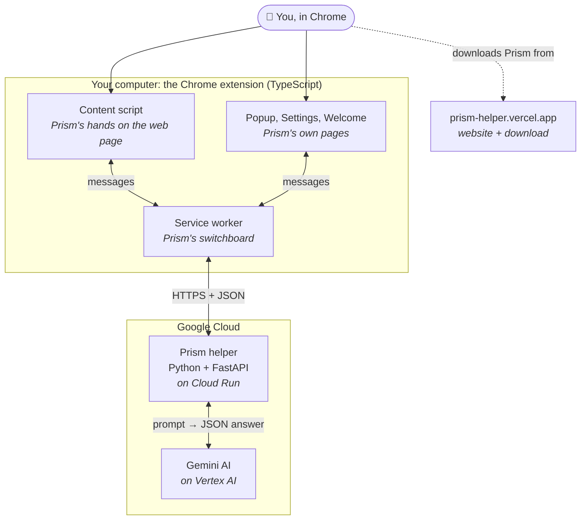
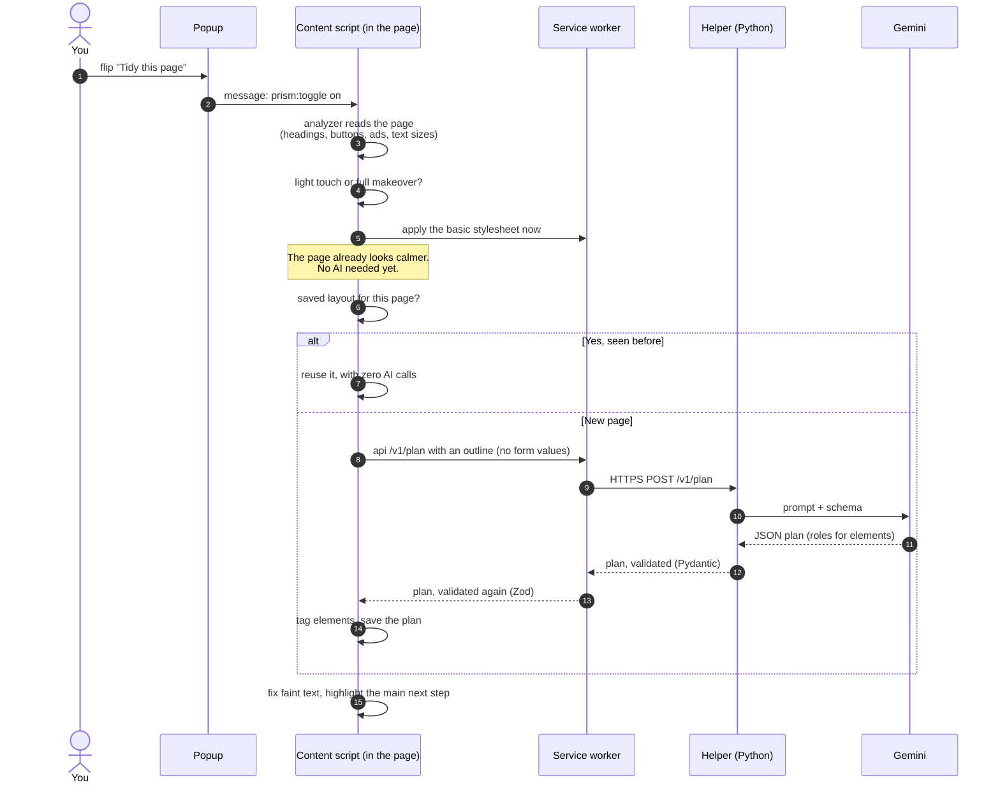
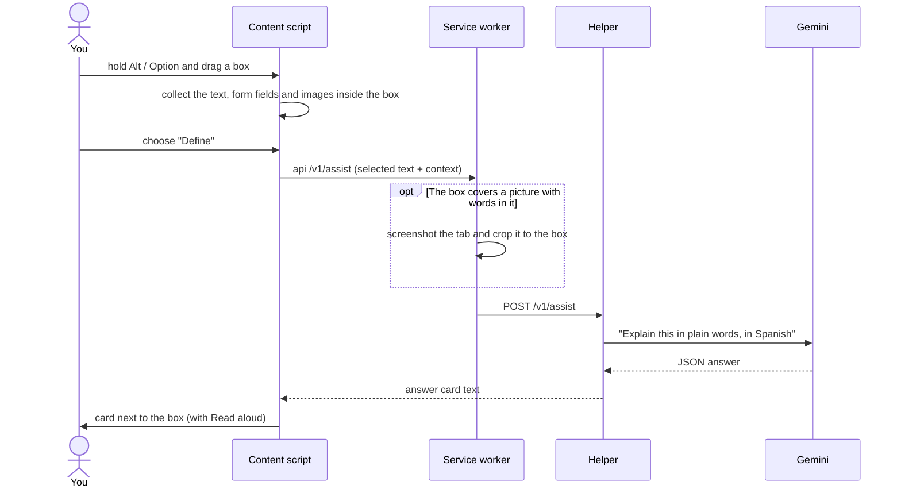
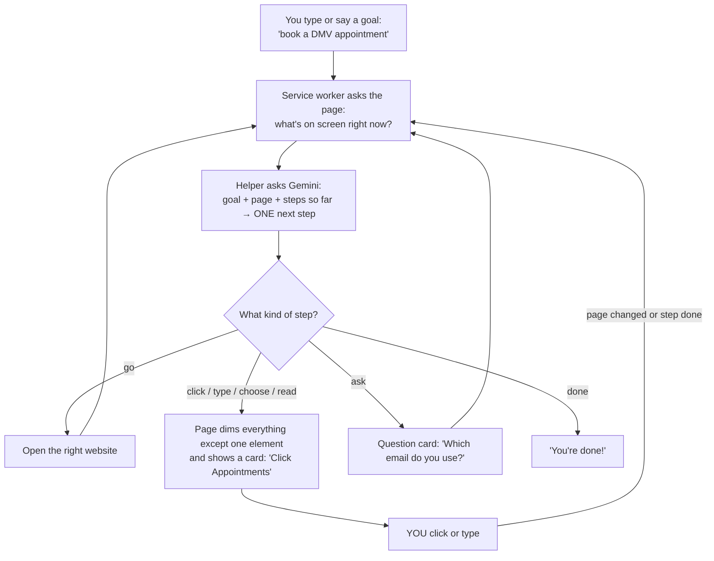
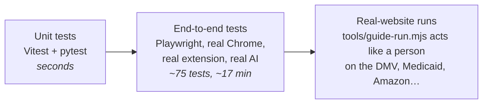
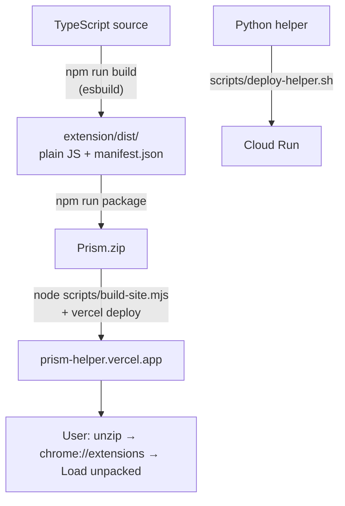

# How Prism works: a guide for beginners

This guide explains Prism to someone who knows a little programming (a first or second CS course) but has
never built a browser extension or a backend. Each section starts with a picture or table you can take in
at a glance, followed by a short explanation.

> **Prism in one sentence:** a Chrome extension that makes confusing websites easier to use. It tidies the
> page, explains whatever you point at, and walks you through tasks step by step, asking an AI (Google's
> Gemini) for help through a small server we wrote.

---

## 1. The big picture



There are three layers, the classic **frontend → backend → external service** shape:

| Layer | Where it runs | What it does | Analogy |
|---|---|---|---|
| **Extension** (frontend) | Inside your Chrome browser | Reads and restyles web pages, draws Prism's buttons and cards | The waiter at your table |
| **Helper** (backend) | A server on Google Cloud Run | Holds the secret AI access, writes the prompts, checks every answer | The kitchen |
| **Gemini** (AI) | Google's Vertex AI | Understands the page and writes plans, explanations and next steps | The expert chef the kitchen calls |

**Why not call the AI straight from the extension?** Anything inside an extension can be read by anyone
who installs it, so a secret key there would be stolen within days. The helper keeps the Google
credentials on the server, limits how often each user can ask (so nobody can run up the bill), and
double-checks that the AI's answers are well-formed before they reach your browser.

---

## 2. Languages and tools

| Tool | Used for | Why this one |
|---|---|---|
| **TypeScript** | All extension code (~7,500 lines) | JavaScript with types: the compiler catches mistakes like a misspelled property before you run anything |
| **Preact** | Prism's buttons, cards, popup, settings | A tiny (a few KB) version of React. You describe what the UI should look like, and it updates the page for you |
| **CSS** | The four page styles and Prism's own look | Prism restyles websites by adding one stylesheet, not by rewriting their HTML |
| **Chrome Extension APIs (Manifest V3)** | Talking to tabs, storage, screenshots, text-to-speech | The only way to run code on every website you visit |
| **esbuild** | Bundles the TypeScript into the files Chrome loads | Very fast. A full build takes about a second |
| **Python** | The helper server (~900 lines) | Google's AI library is excellent in Python, and the code is short and readable |
| **FastAPI** + **Pydantic** | The helper's web endpoints and answer shapes | You declare what a request and response look like, and invalid data is rejected automatically |
| **Gemini on Vertex AI** | Reading pages, explaining, planning, Guide me | Returns *structured JSON* that matches a schema, not just free text |
| **Google Cloud Run** | Hosts the helper | Runs the server only while requests come in, so it costs almost nothing when idle |
| **Vercel** | Hosts the public website and `Prism.zip` | Free, simple static hosting |
| **Zod** | Checks answers again inside the extension | Defence in depth: never trust data just because it came from your own server |
| **Vitest**, **pytest**, **Playwright** | Unit tests (TS and Python) and full browser tests | Playwright drives a real Chrome with the real extension loaded |
| **Git** + **GitHub** | Version control | Every working milestone is a commit you can go back to |

---

## 3. Where everything lives

```text
hackathon/
├── extension/src/            ← the Chrome extension (frontend)
│   ├── content/              ← runs INSIDE every web page
│   │   ├── index.tsx         ← entry point: mounts Prism's UI, listens for messages
│   │   ├── analyzer.ts       ← reads the page: finds headings, buttons, ads, forms
│   │   ├── tidy.ts           ← the "Tidy this page" engine (cache → AI plan → apply)
│   │   ├── touch.ts          ← decides "light touch" (good site) vs "full makeover" (old site)
│   │   ├── contrast.ts       ← fixes text that's too faint to read
│   │   ├── App.tsx           ← Prism's on-page UI: Next step dock, answer cards, chat
│   │   ├── guide.tsx         ← Guide me's spotlight and instruction card
│   │   └── selection.ts      ← the drag-a-box "point at something" gesture
│   ├── background/           ← the service worker (one per browser, no page of its own)
│   │   ├── index.ts          ← the switchboard: routes every message
│   │   ├── api.ts            ← the ONLY place that talks to the helper server
│   │   ├── guide.ts          ← Guide me's step-by-step loop
│   │   └── chat.ts           ← Chat's "do a task" loop
│   ├── popup/  options/  welcome/   ← Prism's own pages (toolbar popup, Settings, first run)
│   ├── shared/               ← code used everywhere: types, storage, styles, translations
│   └── locales/              ← Prism's words in 12 languages (one JSON file each)
├── helper/prism_helper/      ← the Python server (backend)
│   ├── app.py                ← the endpoints: /v1/plan, /v1/assist, /v1/chat, /v1/guide …
│   ├── prompts.py            ← the instructions we give Gemini
│   ├── schemas.py            ← the exact JSON shape each answer must have
│   ├── gemini.py             ← calls Gemini, with a fallback to a backup model
│   └── limits.py             ← rate limits so nobody can run up the bill
├── tests/e2e/                ← Playwright tests: the real extension in a real browser
├── fixtures/                 ← fake local websites the tests use (a messy council site, a shop…)
├── scripts/                  ← build, package, deploy, secret scan
└── tools/                    ← testing on real websites (Guide me runner, design review screenshots)
```

---

## 4. Four ideas to understand first

**① A content script is your code running inside someone else's web page.** Chrome injects
`content.js` into every page you visit. It can read and change that page's HTML, but it's a guest: it
must not break the site. That's why Prism mostly *adds attributes* such as `data-prism-role="heading"`
and *one stylesheet*, instead of rewriting the page. Remove Prism's attributes and the page is exactly
as it was.

**② The service worker is the switchboard.** It has no page of its own. Everything else sends it
messages (`chrome.runtime.sendMessage({ type: "api", path: "/v1/plan", body })`) and it routes them:
to the helper, to a tab, to storage, or to text-to-speech. It's the only part allowed to talk to the
server.

**③ Shadow DOM keeps Prism's UI and the website apart.** Prism's buttons live inside a closed
`<prism-root>` element whose styles can't leak out, and the website's CSS can't leak in. Without it, a
site's `button { color: red }` would turn Prism's buttons red.

**④ The AI returns data, never code.** Gemini is asked for JSON matching a schema (for example "a list
of element ids and the role of each"). Prism's own code then acts on that data. The AI never writes
HTML, CSS or JavaScript that runs on your page, which keeps things predictable and safe.

---

## 5. Walkthrough: "Tidy this page"



**Fast first, smart second:** Prism styles the page immediately with rules that need no AI (bigger
text, darker faint text, ads hidden). The AI plan arrives a moment later and adds the finer structure.
If the AI is down, you still get a calmer page.

---

## 6. Walkthrough: pointing at something ("Define")



---

## 7. Walkthrough: Guide me (a loop)

Guide me is a **loop**. The AI only ever picks the *next single step*, and the person does it.



Design choices worth noticing:

- **Prism never clicks for you.** The spotlight is a dimmed layer with a hole cut out, and your real click
  goes through the hole to the real button. You stay in control, and you learn the site as you go.
- **The AI can't invent buttons.** The helper rejects any step whose element id isn't on the current page.
- **Final presses get a warning.** "Send", "Pay", "Place order" and "Confirm" show *Check everything is
  right before you press it*. Both the AI and Prism's own word list decide this.
- **Websites change while you're mid-step.** If the page reloads, redraws a button or opens a new tab,
  the loop notices and plans again from what's really there.

---

## 8. Safety and privacy, built into the design

| Risk | How Prism handles it |
|---|---|
| Secret keys stolen from the extension | There are none in it. Google credentials live only on the server |
| A website hides instructions for the AI ("ignore your rules and…") | Page text is wrapped and labelled as *untrusted data* in every prompt, and actions come from a fixed, checked list |
| The AI returns something malformed | Checked twice: Pydantic on the server, Zod in the extension |
| Someone runs up the AI bill | Per-user and per-IP rate limits, plus a daily cap on the server |
| Passwords and card numbers | Never sent to the AI, never typed by Prism |
| Your personal details | Stored only in your browser (`chrome.storage.local`), and deletable in Settings |

---

## 9. One feature, both ends: 12 languages

Every English sentence in the UI is wrapped: `t("Guide me")`. A script (`scripts/i18n-extract.mjs`)
collects all of them into `locales/_source.json`, and each language has a file mapping English to its
translation:

```json
{ "Guide me": "Guíeme", "Stop": "Parar" }
```

`t()` looks the sentence up and falls back to English if it's missing, so a missing translation can
never break the screen. The same language setting is also sent to the helper, so the AI's explanations
and Guide me's instructions come back in your language too. Arabic switches the whole UI right-to-left.

---

## 10. How we know it works (testing)



| Level | Example | Command |
|---|---|---|
| Type check | Catches typos and wrong types before running | `npm run typecheck` |
| Unit | "Every translation file covers every phrase" | `npm run test:unit` and `helper/.venv/bin/python -m pytest -q helper/tests` |
| End to end | "Guide me walks someone through sending an email, never acting for them" | `npx playwright test` |
| Real sites | Book a DMV appointment from the home page, stop before Confirm | `node tools/guide-run.mjs tasks.json out/` |
| Secrets | No keys accidentally committed | `node scripts/secret-scan.mjs` |

The end-to-end tests use local fake websites in `fixtures/` (a cluttered council site, a chaotic shop, an
email app) so results don't change when real websites do.

---

## 11. From code to the user's browser



---

## 12. Try it yourself

```bash
npm install                      # get the JavaScript tools
npm run build                    # build the extension into extension/dist
```

Then open `chrome://extensions`, turn on **Developer mode**, click **Load unpacked**, and choose
`extension/dist`. Make a change in `extension/src/`, run `npm run build` again, and press the reload
arrow on Prism's card in `chrome://extensions`.

Good first files to read, in order:

1. `extension/src/shared/types.ts`: the shapes of all the data
2. `extension/src/content/index.tsx`: how the page side starts and listens for messages
3. `extension/src/background/index.ts`: the switchboard
4. `helper/prism_helper/app.py`: the server's endpoints
5. `extension/src/background/guide.ts`: a complete feature loop in about 260 lines

---

## Glossary

| Term | Meaning |
|---|---|
| **Extension** | A small program that adds features to the browser |
| **Manifest** | `manifest.json`: tells Chrome the extension's name, permissions and which files to run |
| **Content script** | Extension code that runs inside web pages |
| **Service worker** | Extension code that runs in the background, without a page |
| **DOM** | The tree of elements that makes up a web page, which code can read and change |
| **Shadow DOM** | A sealed-off mini DOM whose styles don't mix with the page's |
| **API / endpoint** | A URL on a server that accepts a request and returns data, like `POST /v1/guide` |
| **JSON** | The text format used to send data between the extension, the server and the AI |
| **Schema** | A description of exactly what shape some JSON must have |
| **Backend / frontend** | The server side (helper) and the side the user sees (extension) |
| **Rate limit** | A cap on how many requests one user can make in a period of time |
| **Prompt** | The instructions and context sent to an AI model |
| **Cache** | A saved answer reused instead of asking again (Prism saves each page's layout) |
| **i18n** | "Internationalization": making software work in many languages (18 letters between the i and n) |
| **Bundler** | A tool (esbuild) that combines many source files into a few files the browser loads |
